# queue-benchmark

Comparative benchmarks of lock-free queue libraries in C++, measuring throughput, latency, and bulk transfer across single and multi producer/consumer patterns (SPSC, MPSC, MPMC). Includes ready-to-use plots and a breakdown of what each benchmark actually measures.

## Table of contents

- [Libraries](#libraries)
- [Build](#build)
- [Running benchmarks](#running-benchmarks)
- [Plots](#plots)
- [What the benchmarks measure](#what-the-benchmarks-measure)
  - [Throughput](#throughput)
  - [Bulk throughput](#bulk-throughput)
  - [SPSC latency (ping-pong)](#spsc-latency-ping-pong)
  - [MPSC / MPMC latency (embedded timestamp)](#mpsc--mpmc-latency-embedded-timestamp)
- [Thread synchronization pattern](#thread-synchronization-pattern)
- [Notes](#notes)
- [Results](#results)
  - [SPSC](#spsc)
  - [MPSC](#mpsc)
  - [MPMC](#mpmc)
  - [Conclusion](#conclusion)
- [License](#license)

## Libraries

| Library | SPSC | MPSC | MPMC | Bulk |
|---------|------|------|------|------|
| [Boost](https://www.boost.org/doc/libs/release/libs/lockfree/) | ✓ | — | ✓ | — |
| [Moodycamel](https://github.com/cameron314/concurrentqueue) | ✓ | ✓ | ✓ | MPSC / MPMC |
| [Rigtorp](https://github.com/rigtorp/SPSCQueue) | ✓ | — | ✓ | — |
| [Join](https://github.com/joinframework/join) (LocalMem) | ✓ | ✓ | ✓ | ✓ |
| [Join](https://github.com/joinframework/join) (ShmMem) | ✓ | ✓ | ✓ | ✓ |

All dependencies are fetched automatically via CMake FetchContent.

**Join** is the only library benchmarked here that can back its ring buffer with POSIX shared memory (`ShmMem`, via `shm_open`/`mmap(MAP_SHARED)`) instead of process-local anonymous memory (`LocalMem`, `mmap(MAP_ANONYMOUS)`). Both variants run in the same process in this benchmark — **Join (Shm)** measures the overhead of the shared-memory backend itself (POSIX shm bookkeeping vs. anonymous mmap), not real inter-process transfer, since actual cross-process IPC would require a separate producer/consumer process pair.

## Build

Configure the project:

```bash
cmake -B build -DCMAKE_BUILD_TYPE=Release
```

Compile:

```bash
cmake --build build -j$(nproc)
```

## Running benchmarks

Run everything and generate plots:

```bash
cd scripts && bash run_bench.sh
```

Single binary:

```bash
./build/benchmarks/spsc/bench_spsc_throughput \
    --benchmark_format=json \
    --benchmark_out=results/spsc_throughput.json
```

Filter a specific configuration — `--benchmark_filter` takes a regex matched against the benchmark name (e.g. `MPMC/Throughput/Join (Local)/4/4/4096`); this one keeps only the 4-producer/4-consumer runs:

```bash
./build/benchmarks/mpmc/bench_mpmc_throughput --benchmark_filter="4/4/"
```

> [!NOTE]
> Default: 10 repetitions. Override with `REPETITIONS=5 bash run_bench.sh`.

## Plots

Install plotting dependencies:

```bash
pip install -r plots/requirements.txt
```

Generate the charts:

```bash
cd plots && python3 plot.py ../results/*.json
```

PNGs are written to `plots/`. Latency results produce two charts per queue type: `*_latency_dist.png` (Min/Mean/Max) and `*_latency_pct.png` (P50/P90/P99).

---

## What the benchmarks measure

### Throughput

**Goal**: maximum sustained transfer rate (items/s) under full load.

**Protocol**:
- Two `std::barrier` instances synchronize startup: all threads wait at `ready`, then are released simultaneously by `go`. This eliminates thread creation overhead from the measurement.
- Producers push `N` items as fast as possible (`while (!push) cpu_pause()`).
- Consumers drain until an atomic counter reaches `N`.
- Wall time is measured between `go` and the last thread join using the TSC (`UseManualTime`).

**What is measured**: saturated pipe throughput — how fast the queue can transfer items when producers and consumers run flat-out simultaneously.

**What is not measured**: per-item latency, startup effects, thread creation costs.

**SPSC parameters**: capacity = 256 / 4096 / 65536.  
**MPSC/MPMC parameters**: {nProducers, nConsumers, capacity}, with symmetric configs (1P/1C, 2P/2C, 4P/4C, 8P/8C) and asymmetric ones (4P/1C, 1P/4C).

---

### Bulk throughput

**Goal**: throughput when transfers are batched — amortizing the cost of atomic operations over multiple items per call.

**Protocol**: identical to throughput, but producers call `push_bulk(buf, batch)` and consumers call `pop_bulk(buf, batch)` instead of single-item operations. Batch sizes tested: 8, 64, 256.

**What is measured**: how much throughput gain (or loss) a library's native bulk API provides compared to single-item transfers. Only libraries with a native bulk API are included — simulating bulk with a loop would measure loop overhead, not bulk performance.

**SPSC parameters**: {batch_size}.  
**MPSC parameters**: {nProducers, batch_size}.  
**MPMC parameters**: {nProducers, nConsumers, batch_size}.

---

### SPSC latency (ping-pong)

**Goal**: round-trip time of a single item between two threads.

**Protocol**:
```
main ──[push(42)]──▶ request_q ──▶ consumer ──[push(42)]──▶ reply_q ──▶ main
```
- The consumer thread runs continuously for the entire benchmark duration.
- For each round-trip: `t0 = rdtsc()` → push to `request_q` → spin-wait on `reply_q` → `delta = rdtsc() - t0`.
- 100,000 round-trips per Google Benchmark iteration. Samples are sorted at the end to compute min / mean / max / P50 / P90 / P99.
- Timing uses the TSC (Time Stamp Counter) calibrated at program startup: ~5 cycles overhead vs ~25 ns for `clock_gettime`.

**What is measured**: round-trip latency — total time from the intent to push until the reply is received. Includes two queue traversals and two cross-core cache coherency transfers. Only one item is in flight at a time, so there is no queuing delay.

**What is not measured**: one-way latency (divide by 2 for an estimate).

---

### MPSC / MPMC latency (embedded timestamp)

**Goal**: per-item latency from push to pop under realistic concurrent load.

**Protocol**:
- Each producer embeds a TSC timestamp into the item at push time: `item = rdtsc()`.
- Each consumer computes the delta at pop time: `latency = rdtsc() - item`.
- 100,000 items total per iteration. Latencies are collected per consumer and merged at the end to compute min / mean / max / P50 / P90 / P99.

**What is measured**: total time an item spends in the system, from the intent to push until it is popped. This includes:
1. Producer spin time waiting for a free slot if the queue is full (the timestamp is captured *before* the push loop).
2. Time waiting in the queue.
3. Time until the consumer reaches this item.

**Interpretation**: producers and consumers run simultaneously at full speed, so the queue tends to stay saturated. The measured latency is therefore dominated by **queuing delay** (Little's Law: L = λ × W), not by the queue's intrinsic service time. A high-throughput queue running a saturated ring will mechanically produce higher measured latency. This benchmark is most useful for detecting pathologically high individual latency — such as Moodycamel MPSC, whose batch-oriented design produces per-item latencies in the millisecond range.

---

## Thread synchronization pattern

All benchmarks use the same two-barrier startup pattern:

```
threads          main
  ┌─ ready ◀────────────────────────────── arrive_and_wait()
  │  ready ────────────────────────────────────────────────┐
  └─ go    ◀────────────────────────────── arrive_and_wait()
           ────────────────────────────────────────────────┘
           [measurement starts here]
```

The `ready` barrier ensures all threads are created and initialized. The `go` barrier releases them simultaneously to eliminate staggered-start effects.

---

## Notes

- `-march=native`: CPU-specific optimizations. Results are not portable across machines.
- TSC is calibrated over 20 ms at program startup, before any benchmark runs.
- `REPETITIONS=10` by default: Google Benchmark reports the mean across repetitions. SPSC latency is sensitive to OS scheduling noise on its single ping-pong thread pair, so more repetitions help reduce run-to-run variance.
- All benchmarks time with the TSC exclusively (throughput, bulk, and latency alike) for consistent, low-overhead measurement.
- `run_bench.sh` sets `--benchmark_min_warmup_time=0.1` to stabilize CPU frequency scaling before measurement starts.
- Boost MPMC uses `fixed_sized<true>`: fixed ring buffer with no dynamic allocation, guaranteeing lock-freedom.
- Result JSONs are gitignored (`results/`); plots are committed under `plots/`.

---

## Results

Measured on a development machine. Re-run `scripts/run_bench.sh` to reproduce on other hardware — results are not portable across machines (`-march=native`).

### SPSC

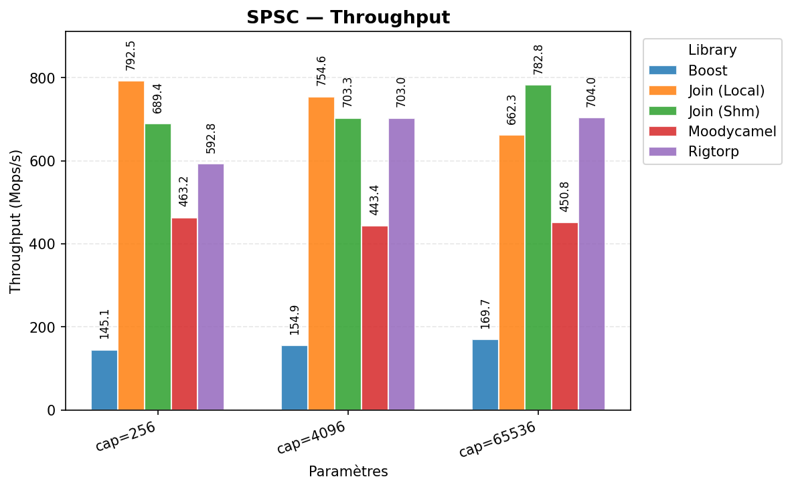

**Join (Local)** and **Join (Shm)** lead across all capacities (660–790 Mops/s), followed by **Rigtorp** (~590–700 Mops/s). **Boost** trails by roughly 4-5x — its `spsc_queue` is not optimized for this access pattern the way the others are. The shared-memory backend (**Join (Shm)**) costs a bit extra over **Join (Local)** at low capacity, but takes the lead at cap=65536.

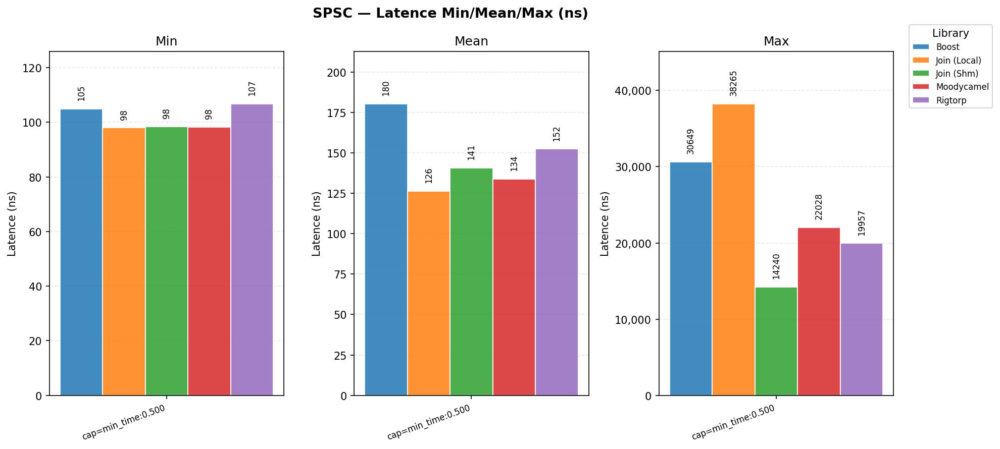
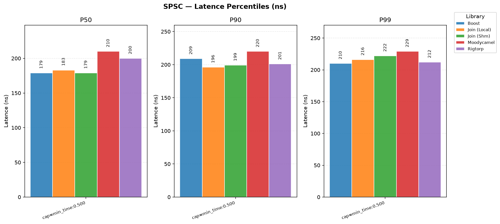

Round-trip latency is tight across all five (mean 126–180 ns); **Join (Local)** has the lowest mean, **Boost** the highest. Max latencies (14–38 µs) are dominated by OS scheduling noise rather than the queue implementation, and vary the most run-to-run of any metric in this benchmark — **Join (Local)** has the highest max here despite the lowest mean, illustrating how tail latency and typical latency can diverge under scheduler noise.

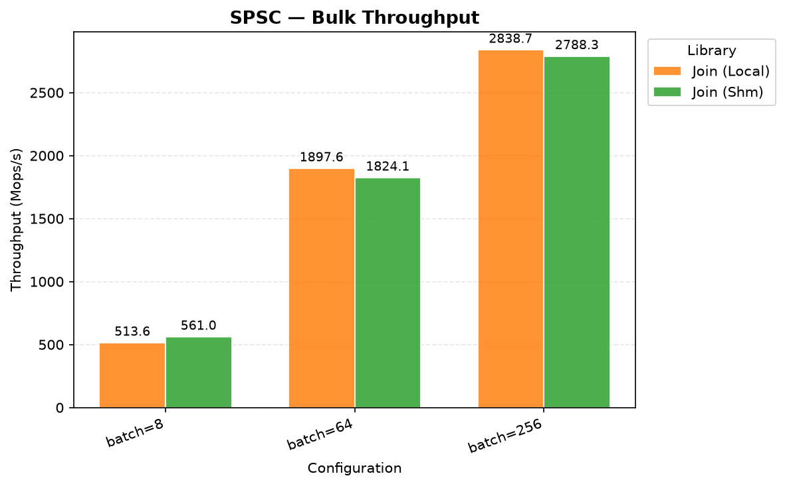

Only **Join** exposes a native bulk API for SPSC. Batching lifts throughput from ~550-575 Mops/s (batch=8) to ~1.6–1.7 Gops/s (batch=256). **Join (Local)** stays ahead of **Join (Shm)** at every batch size — the shared-memory overhead is small but consistent.

### MPSC

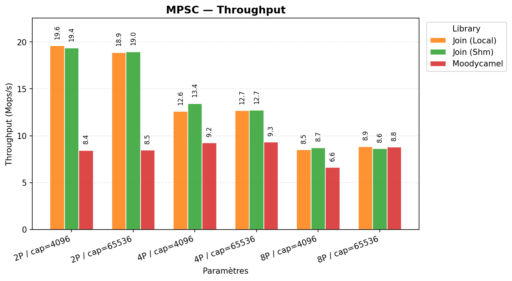

**Join (Local)** and **Join (Shm)** are neck-and-neck (within ~1 Mops/s of each other) and both clearly beat **Moodycamel** at low producer counts (2P: ~19-20 vs 8.4-8.5 Mops/s). The gap narrows as producer count grows — at 8P all three converge to ~8.6-8.9 Mops/s, meaning the ring buffer's CAS contention on the head index dominates over implementation differences once enough producers are competing.

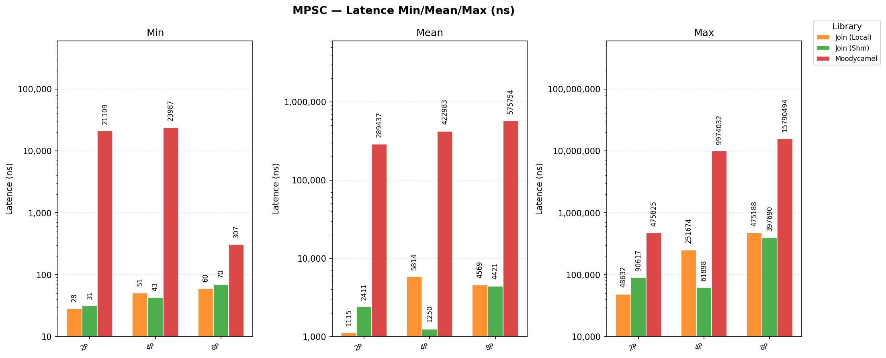
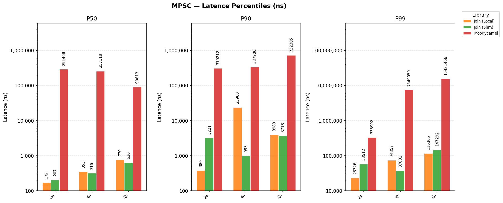

The standout result: **Moodycamel**'s MPSC latency is 2-3 orders of magnitude higher than **Join**'s at every producer count (mean 289 µs–576 µs vs ~1.1–5.8 µs for **Join**). This is a direct consequence of **Moodycamel**'s block-based design, which is optimized for bulk/producer-token throughput, not per-item latency under saturation. **Join (Local)** and **Join (Shm)** are statistically indistinguishable here — the shared-memory backend adds no measurable latency penalty under contention.

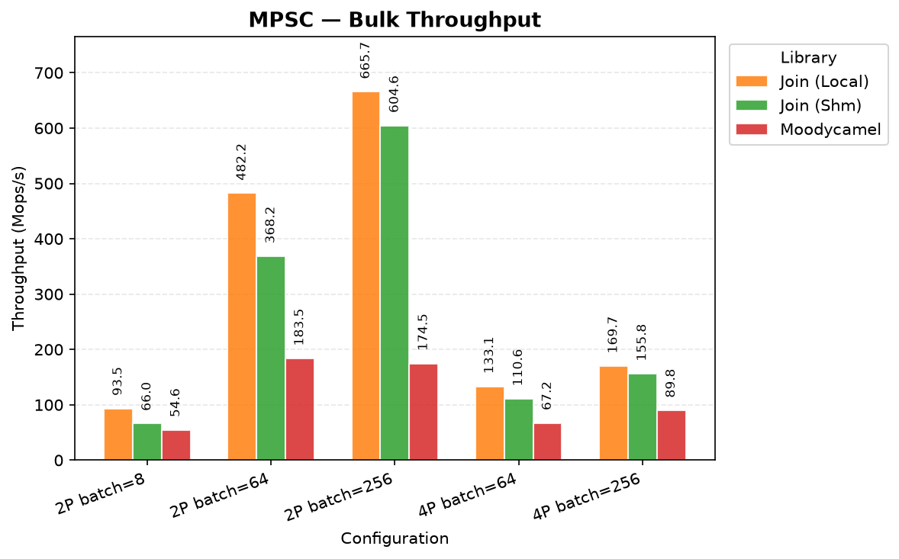

**Join (Local)** and **Join (Shm)** again track each other closely and outperform **Moodycamel** at small/medium batches; **Moodycamel** catches up and overtakes at batch=256 with 4 producers, where its block-based bulk path starts to pay off.

### MPMC

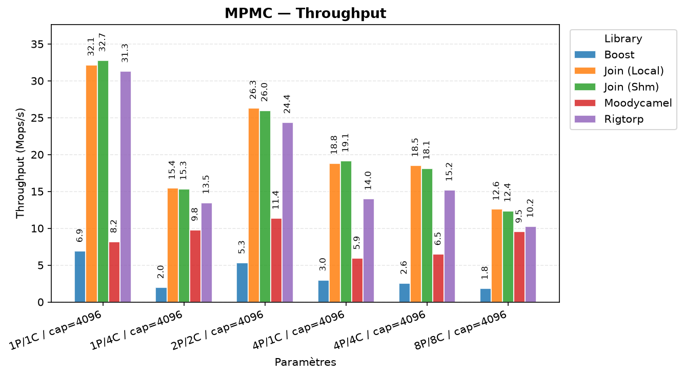

At 1P/1C, **Rigtorp** and **Join** saturate around 40-42 Mops/s while **Boost** and **Moodycamel** lag (5-10 Mops/s) — **Boost**'s `fixed_sized` lock-free queue and **Moodycamel**'s general-purpose design both carry more overhead in the uncontended case. As producer/consumer count grows, all libraries converge toward 5-13 Mops/s: contention on the shared ring dominates regardless of implementation. **Join (Shm)** tracks **Join (Local)** within a few percent at every configuration — the shared-memory indirection does not change the throughput story for MPMC either.

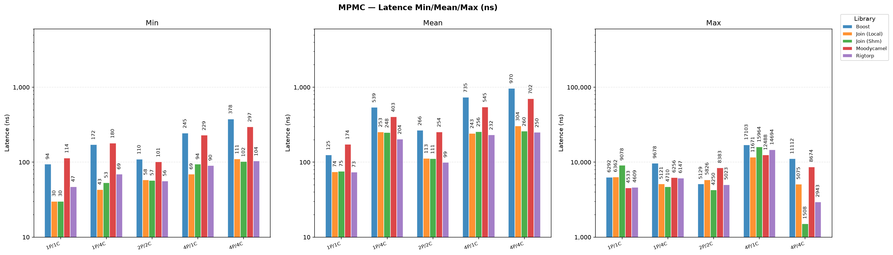
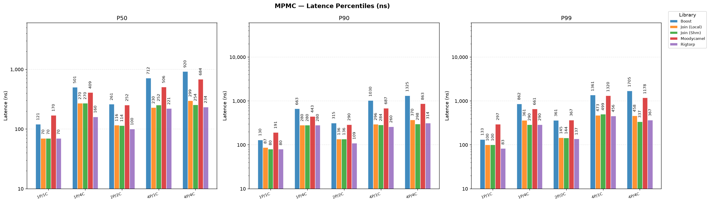

Latency is dominated by queuing delay at high contention (see [Interpretation](#mpsc--mpmc-latency-embedded-timestamp) above), not by implementation. **Moodycamel**'s Max/P99 spike to ~9-9.6 ms at 4P/1C and 4P/4C stands out — consistent with the same batch-oriented latency cliff seen in MPSC. **Join (Local)** and **Join (Shm)** remain close to each other and to **Boost**/**Rigtorp** across all metrics.

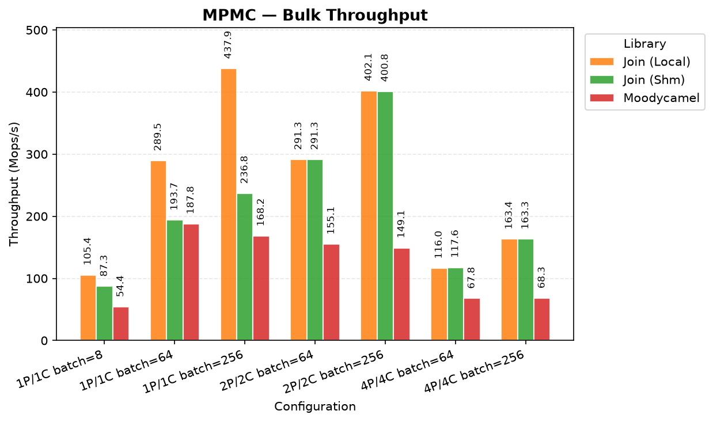

**Join (Local)** and **Join (Shm)** again perform almost identically and both edge out **Moodycamel** at small producer/consumer counts; the three converge as contention increases.

### Conclusion

How the libraries compare, in one paragraph each:

- **Join (Local)** and **Join (Shm)** are the strongest all-rounders in this benchmark: they win or tie for first on throughput in almost every SPSC/MPSC/MPMC configuration, keep latency competitive with the fastest libraries under saturation, and **Join** is the only library offering a native bulk API across all three patterns plus an interchangeable shared-memory backend. **Join (Shm)** tracks **Join (Local)** within a few percent everywhere — choosing the shared-memory variant for cross-process use costs essentially nothing.
- **Rigtorp** (SPSCQueue / MPMCQueue) is a close second: it matches or slightly beats **Join** at low contention (e.g. MPMC 1P/1C throughput, SPSC mean latency) but has no bulk API and no MPSC queue, so its scope is narrower.
- **Moodycamel** (ConcurrentQueue / ReaderWriterQueue) is throughput-competitive, particularly at higher producer counts and with large bulk batches where its block-based design pays off, but it is the clear latency outlier: mean and P99 latency under saturation are 2-3 orders of magnitude higher than **Join** or **Rigtorp** in MPSC, with a similar spike in some MPMC configurations. It is the best choice when the workload is bulk/throughput-oriented and insensitive to tail latency; a poor choice when per-item latency matters.
- **Boost** trails the others in raw throughput (4-5x slower than **Join**/**Rigtorp** in SPSC, 5-10x in low-contention MPMC) and offers no MPSC queue or bulk API. Its main practical advantage is guaranteed lock-freedom via `fixed_sized<true>` with no dynamic allocation — a correctness/portability guarantee the other libraries don't make as explicitly, at the cost of performance.
- **Contention narrows all these gaps**: at high producer/consumer counts (8P/8C and beyond), every MPMC/MPSC library converges toward similar throughput, since CAS contention on the shared ring — not the library's internal design — becomes the dominant cost. Library choice matters most at low-to-moderate contention and for latency-sensitive workloads; it matters least once the ring is heavily contended.

---

## License

Licensed under the [MIT License](LICENSE).
